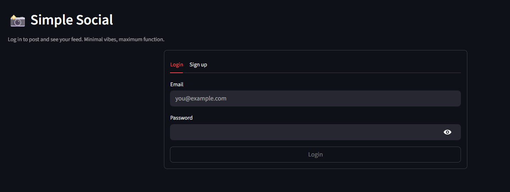
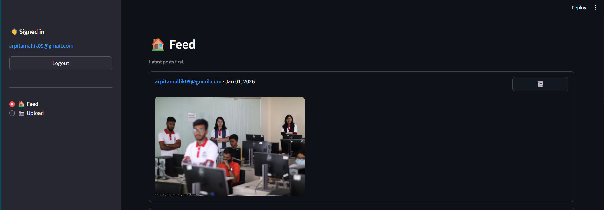
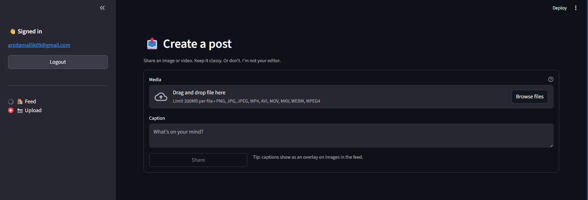

# Simple Social

A minimal social media application built with **FastAPI** and **Streamlit** that supports authenticated image and video uploads, a feed view, and basic post management.

The project focuses on clear backend architecture, modern authentication, and a simple but usable UI.

### Login


### Feed


### Upload



---

## Features

* User authentication using JWT (FastAPI Users)
* Image and video uploads
* Media storage and delivery via ImageKit
* Feed displaying recent posts
* Delete posts (owner only)
* Streamlit-based frontend
* Async FastAPI backend with SQLAlchemy

---

## Tech Stack

### Backend

* FastAPI
* SQLAlchemy (async)
* SQLite
* FastAPI Users (JWT authentication)
* ImageKit

### Frontend

* Streamlit

---

## Project Structure

```
MediaHub/
├── app/
│   ├── app.py          # FastAPI application
│   ├── db.py           # Database models and session
│   ├── users.py        # Authentication setup
│   ├── images.py       # ImageKit configuration
│   └── schemas.py      # Pydantic schemas
│
├── streamlit_app.py    # Streamlit frontend
├── test.db             # SQLite database
├── requirements.txt
└── README.md
```

---

## Setup and Installation

### 1. Clone the repository

```bash
git clone https://github.com/ArpitaMallik/Simple-Social.git
cd MediaHub
```

### 2. Create and activate a virtual environment

```bash
python -m venv venv
```

**Windows**

```powershell
.\venv\Scripts\activate
```

**macOS / Linux**

```bash
source venv/binactivate
```

---

### 3. Install dependencies

```bash
python -m pip install -r requirements.txt
```

---

### 4. Environment variables

Create a `.env` file in the project root:

```env
IMAGEKIT_PUBLIC_KEY=your_public_key
IMAGEKIT_PRIVATE_KEY=your_private_key
IMAGEKIT_URL=https://ik.imagekit.io/your_id
```

---

## Running the Application

### Start the backend

```bash
uvicorn app.app:app --reload
```

API documentation is available at:

```
http://localhost:8000/docs
```

---

### Start the frontend

```bash
streamlit run streamlit_app.py
```

The frontend runs at:

```
http://localhost:8501
```

---

## Authentication Flow

1. Register a user via `/auth/register` or the Streamlit UI
2. Log in to receive a JWT token
3. Authenticated requests include the token automatically
4. Protected routes require authentication

---

## Upload Flow

1. Select an image or video
2. Add an optional caption
3. Media is uploaded to ImageKit
4. Post metadata is stored in the database
5. The feed updates immediately

---

## Feed Behavior

* Displays posts in reverse chronological order
* Supports both images and videos
* Captions appear as overlays on images
* Delete option is visible only to the post owner

---

## Known Limitations

* SQLite is used for local development
* No pagination or infinite scrolling
* No likes or comments yet
* No deployment configuration included

---

## Possible Improvements

* User profiles
* Likes and comments
* Pagination
* Cloud deployment
* Database migration to PostgreSQL
* Automated tests

---

## Purpose

This project was built to practice:

* Building APIs with FastAPI
* JWT-based authentication
* Async database access
* Integrating third-party media services
* Creating a simple frontend that communicates with a REST API


Just tell me how “serious” you want it to be.
